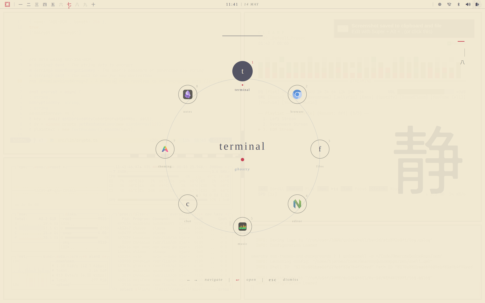
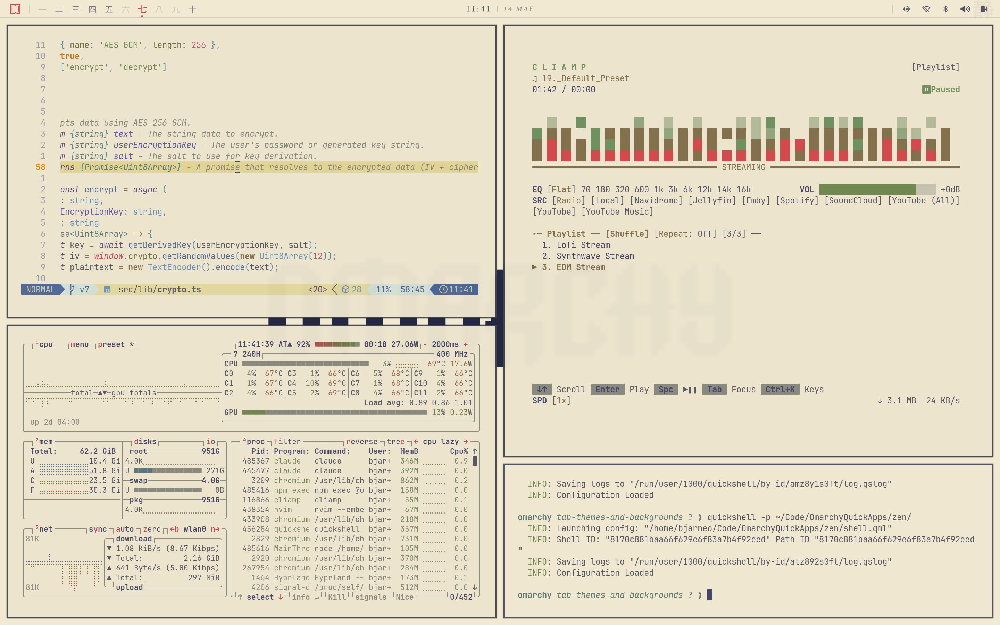

# Kanagawa Lotus

A light-mode theme for [Omarchy](https://github.com/basecamp/omarchy), based on the [Kanagawa Lotus](https://github.com/rebelot/kanagawa.nvim) palette (slightly modified).




## Installation

```sh
omarchy-theme-install https://github.com/bjarneo/omarchy-kanagawa-lotus-theme
```

## Optional: Quickshell navbar

A matching top bar is bundled as `navbar.qml`. It replaces Waybar with a thin Kanagawa Lotus panel: kanji workspace numerals, vermillion seal accents, and a centered serif clock.

Requirements: `quickshell`, `hyprctl`, `pamixer`, `bluetoothctl`, `nmcli`, a Nerd Font (the config uses `JetBrainsMono Nerd Font`).

Run it:

```sh
omarchy toggle waybar
quickshell -p ~/.config/omarchy/current/theme/navbar.qml
```

The first command disables Waybar (the navbar owns the top layer-shell zone, so the two cannot run together). The second launches the panel. To autostart it, add the `quickshell` command to your Hyprland `exec-once` block.

Left-click triggers the primary action on each module; right-click on the Omarchy mark opens a terminal, and right-click on the audio module toggles mute.

## Quick apps selector

The selector shown in the screenshots is the `zen` shell from [omarchy-quickapps](https://github.com/bjarneo/omarchy-quickapps), a separate Quickshell launcher you can install alongside this theme.
